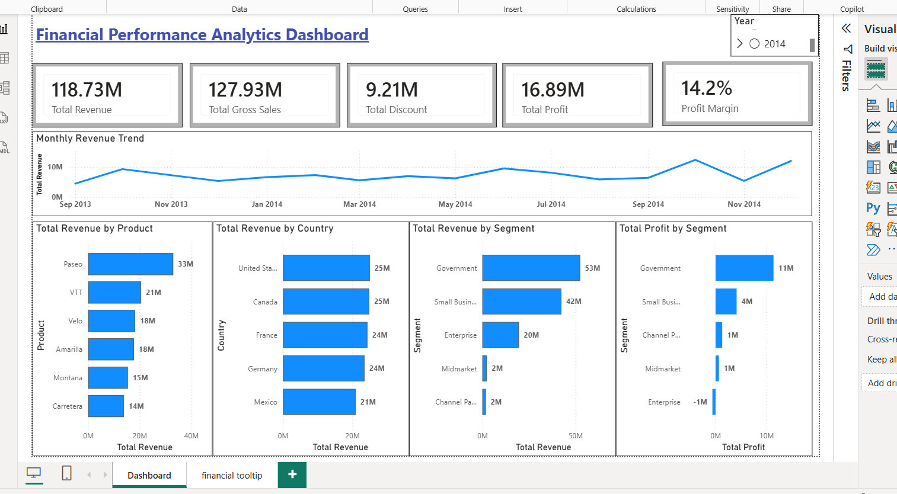

# Financial Performance Analytics Dashboard | Power BI

Interactive Power BI dashboard analyzing revenue, profit, discounts, and financial performance using Power Query, DAX, and data visualization.

---

## Dashboard Preview

## Project Overview

This project demonstrates how Power BI can transform financial data into meaningful business insights through an interactive executive dashboard.

The dashboard analyzes revenue, gross sales, discounts, profit, and profit margin across products, countries, customer segments, and time periods.

## Business Objectives

This dashboard helps answer key business questions:

- Which products generate the highest revenue?
- Which countries contribute the most revenue?
- Which customer segments are the most profitable?
- How does revenue change over time?
- What is the overall financial performance of the business?

  ## Key KPIs

The dashboard tracks the following business metrics:

- Total Revenue
- Total Gross Sales
- Total Discount
- Total Profit
- Profit Margin (%)

---

## Dashboard Features

- Executive KPI Cards
- Revenue Trend Analysis
- Product Performance Analysis
- Country Performance Analysis
- Revenue by Customer Segment
- Profit by Customer Segment
- Interactive Year Slicer
- Cross-filtering Between Visuals
- Custom Report Page Tooltip

---

## Data Model

The report uses a Calendar table connected to the Financials table through the Date field.

Additional calendar attributes include:

- Year
- Quarter
- Month
- Month Name
- Day Name
- Day Number

This structure enables accurate time intelligence and interactive filtering.

## Skills Demonstrated

### Power BI
- Dashboard Design
- Interactive Reporting
- KPI Development
- Cross-filtering
- Report Page Tooltips

### Power Query
- Data Cleaning
- Data Transformation
- Data Preparation

### DAX
- SUM()
- DIVIDE()
- Calendar Table
- Time Intelligence
- KPI Measures

### Business Intelligence
- Financial Analytics
- Executive Reporting
- Trend Analysis
- Product Performance Analysis
- Geographic Analysis

  ## Key Business Insights

- Government segment generated the highest revenue.
- Government segment also delivered the highest overall profit.
- Paseo was the top-performing product based on revenue.
- Revenue increased toward the end of the reporting period.
- The United States and Canada contributed the highest revenue.
- Profitability varied significantly across customer segments.

  ## Tools Used

- Microsoft Power BI
- Power Query
- DAX
- Microsoft Excel

---

## Author

**Chandrakala Saini**

- GitHub: https://github.com/saini2992
- LinkedIn: https://www.linkedin.com/in/chandrakala-saini-11a5b022a/
